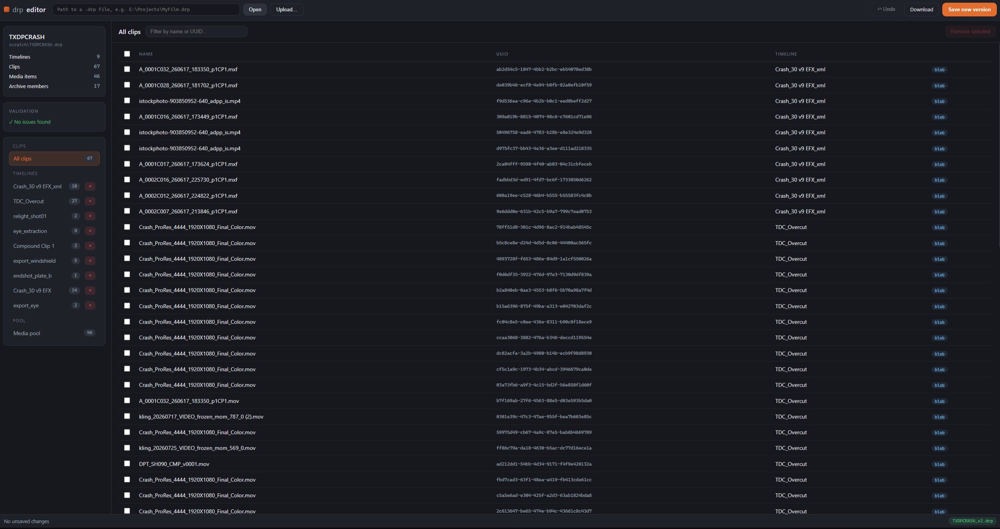
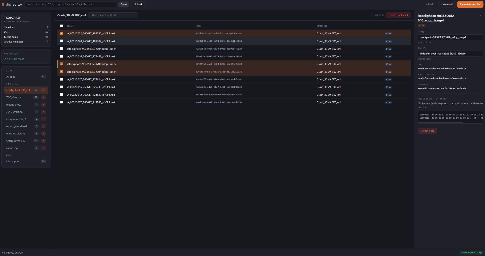

# drp-editor

A production-quality Python library and CLI for opening, inspecting, modifying,
validating, and rebuilding **DaVinci Resolve `.drp` corrupt project files** — while
preserving every byte that is not intentionally modified.

The long-term goal is a reverse-engineering toolkit capable of repairing damaged
Resolve projects (such as corrupted AI Super Scale settings) **without requiring
Resolve to open the project at all**.

## Design principles

1. **Unknown data is never modified.** Unedited sections are written back
   byte-for-byte identical. An unmodified project saves as a perfect copy.
2. **Compatibility over prettiness.** XML is never regenerated wholesale; only
   requested values are edited. Comments, ordering, whitespace, unknown nodes,
   and unknown attributes all survive.
3. **Gradual reverse engineering.** Undocumented binary blobs are modeled as
   `FieldsBlob` objects whose known fields grow over time via a JSON signature
   database — unknown bytes always round-trip unchanged.
4. **Every change is auditable.** All modifications generate `Patch` records
   (with undo support) so you always know exactly what was touched.

## Installation

```bash
pip install -e ".[dev]"
```

Requires Python 3.11+.

**New here?** See [`docs/howto.md`](docs/howto.md) for a simple clone → install → `drp ui` → browser walkthrough.

## Quick start (library)

```python
import drp_editor

project = drp_editor.open_project("MyProject.drp")

for timeline in project.timelines:
    print(timeline.name, len(timeline.clips))

clip = project.find_clip(name="Camera001.mov")
project.set_property(clip, "name", "Renamed.mov")   # records a Patch

project.save("MyProject.fixed.drp")   # everything else byte-identical
```

## Web UI / local server

The editor ships with a small FastAPI server and a vanilla JS front end.
One process = one open project (local, single-user). All mutations go through
the same `Project` API as the library, so byte-preservation and undo still
apply.

<<<<<<< HEAD


=======
>>>>>>> 712bd41 (Expand README with web UI and local server usage.)
### Start the server

```bash
drp ui                         # http://127.0.0.1:8765 (opens browser)
drp ui MyProject.drp           # preload a project on launch
drp ui --port 9000             # custom port
drp ui --host 0.0.0.0          # bind all interfaces (use with care)
drp ui --no-open               # start without opening a browser
```

Stop with `Ctrl+C`. Dependencies (`fastapi`, `uvicorn`) are included in the
default install — no extra extras to install.

You can also mount the app yourself:

```python
from drp_editor.web import create_app
from drp_editor.web.session import Session

session = Session()
session.open(Path("MyProject.drp"))  # optional preload
app = create_app(session)            # ASGI app for uvicorn / etc.
```

### Using the UI

1. **Open a project** — paste a filesystem path in the top bar and click
   **Open**, use **Upload…**, or drag a `.drp` onto the empty state. Broken
   files are welcome; structural validation issues appear in the sidebar
   immediately.
2. **Browse** — the left nav lists all clips, unattached clips (if any), each
   timeline, and the media pool. Use the search box to filter by name or UUID.
3. **Inspect** — click a row to open the details panel. For clips you get
   editable fields plus the FieldsBlob (known decoded fields and a hex dump,
   truncated at 4 KiB). Click a timeline's × in the nav to remove that timeline.
4. **Edit** — change a property in the details panel and press **Enter** to
   apply. Multi-select rows (checkboxes) and **Remove selected** to delete
   clips, media items, or timelines. Every change records a patch.
<<<<<<< HEAD


=======
>>>>>>> 712bd41 (Expand README with web UI and local server usage.)
5. **Undo** — **Undo** in the top bar, or `Ctrl+Z` / `Cmd+Z` (when not typing
   in an input).
6. **Save** —
   * **Save new version** writes `MyProject_v2.drp`, `_v3.drp`, … next to the
     source file (never overwrites the original; saved paths show as chips in
     the status bar).
   * **Download** returns the current in-memory state as
     `<stem>_edited.drp` without writing beside the source.

The status bar shows how many unsaved patches are pending. Closing the browser
tab does not stop the server; stop the `drp ui` process when finished.

## Quick start (CLI)

```bash
drp info project.drp                 # summary
drp timelines project.drp            # list timelines
drp clips project.drp                # list clips (optionally --timeline)
drp media project.drp                # list media pool
drp search project.drp "Camera\d+"   # regex search
drp validate project.drp             # structural checks
drp diff before.drp after.drp        # full diff incl. blob byte changes
drp dump-fields project.drp --clip c-001   # hex dump + decoded fields
drp export-json project.drp -o dump.json
drp import-json project.drp dump.json out.drp
drp patch project.drp out.drp --set "c-001.name=New.mov"
drp repair --list                    # available repair plugins
drp repair-ai-upscale project.drp fixed.drp
```

Add `-v` / `-vv` for INFO / DEBUG logging, and `--signatures db.json` to load a
blob signature database (see below).

## Reverse engineering workflow

1. Export a project from Resolve (`before.drp`).
2. Toggle exactly one setting in Resolve, export again (`after.drp`).
3. Run `drp diff before.drp after.drp` — the report shows the exact byte
   offsets that changed inside each clip's FieldsBlob.
4. Record the discovery in a signature database:

```json
{
  "clip": [
    {"name": "super_scale", "offset": 72, "type": "uint8",
     "description": "AI Super Scale mode; 0 = disabled"}
  ]
}
```

5. Load it with `--signatures db.json`; the field is now decodable, editable,
   and repairable everywhere.

See `docs/reverse_engineering.md` for the full guide.

## Architecture

| Module | Responsibility |
| --- | --- |
| `drp_editor.archive` | .drp container: open, extract, CRC verify, byte-preserving rebuild |
| `drp_editor.xml_editor` | Format-preserving XML editing (lxml, dirty tracking) |
| `drp_editor.parser` | Configurable, heuristic XML → object model construction |
| `drp_editor.models` | `Project` / `Timeline` / `Clip` / `MediaItem` / `Settings`, search API, patch-recording mutation |
| `drp_editor.fields_blob` | Hex blobs, field schemas, signature registry, byte diffs |
| `drp_editor.binary` | Reusable `BinaryReader` / `BinaryWriter` framework |
| `drp_editor.patch` | Patch objects, patch log, undo, JSON persistence |
| `drp_editor.diff` | Project / timeline / clip / binary diff engine |
| `drp_editor.validation` | Duplicate UUIDs, broken references, corrupt blobs, CRC failures |
| `drp_editor.repairs` | Plugin framework (`scan` / `repair` / `validate`) + AI upscale repair |
| `drp_editor.cli` | Typer CLI |
| `drp_editor.web` | Local FastAPI server + static UI (`drp ui`) |

See `docs/architecture.md` for details and extension points.

## Development

```bash
pytest                      # test suite
black drp_editor tests     # formatting
ruff check drp_editor tests
mypy drp_editor
```

## Status and limitations

* The parser is heuristic-driven (`ParserConfig`) because Resolve's XML schema
  is undocumented and version-dependent; unusual schemas may need a custom
  config.
* Blob field offsets vary between Resolve versions — signature databases
  should be built per version using the diff workflow above.
* Once an XML document *is* edited, attribute quoting is normalized to double
  quotes on re-serialization (Resolve accepts this; unmodified files are
  untouched).
